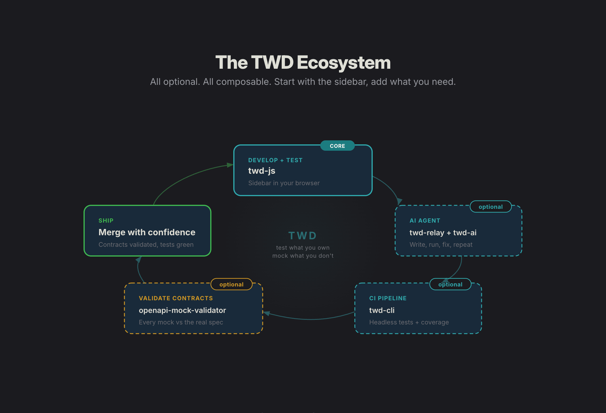

# Hi, I'm Kevin 👋

Software Architect at [Orbitant](https://github.com/weorbitant), based in Madrid. I maintain **TWD (Test While Developing)**, an open source testing ecosystem I build with the team at [BRIKEV](https://github.com/BRIKEV).

The idea behind everything I work on: tests should run while you develop, not after.

## TWD

Frontend tests that run in your real browser, against your real backend. No jsdom, no separate E2E stack.

  

| Package | Version | What it does |
|---------|---------|--------------|
| [twd-js](https://github.com/BRIKEV/twd) |  | In-browser test runner with a live sidebar UI. Works with React, Vue, Angular and Solid. |
| [twd-relay](https://github.com/BRIKEV/twd-relay) |  | WebSocket relay so AI agents and external tools can trigger and observe test runs. |
| [twd-cli](https://github.com/BRIKEV/twd-cli) |  | Headless runner for CI, powered by Puppeteer. |
| [twd-ai](https://github.com/BRIKEV/twd-ai) | | Claude Code plugin and skills so AI agents write and run TWD tests on their own. |

Start at [twd.dev](https://twd.dev/). The thinking behind the approach lives in [twd-principles](https://github.com/BRIKEV/twd-principles).

## Talks and podcasts

- [TWD: Una nueva forma de testear el frontend](https://www.youtube.com/watch?v=F0b63Cl6_Mo) (Spanish)
- [Testing while developing: una nueva forma de testear en frontend](https://www.youtube.com/watch?v=qsHowBWgJn8) (Spanish)
- Podcast: [Una nueva forma de testear frontend con TWD](https://www.youtube.com/watch?v=qkFe4kayGIw) (Spanish, also on [Spotify](https://spotifycreators-web.app.link/e/a6xQdwYSF0b))
- Podcast: [How to Test This #14: How to Test with Testing While Developing (TWD)](https://youtu.be/O4QahYTYQgE) (English, also on [Spotify](https://open.spotify.com/episode/6mQV2liEL68mM9JqRXpPVo))

## Writing

I write about testing and the TWD approach on [dev.to](https://dev.to/kevinccbsg).

## Reach me

- [LinkedIn](https://www.linkedin.com/in/kevinjmartinez/)
- [dev.to](https://dev.to/kevinccbsg)
- [Bluesky](https://bsky.app/profile/kevintwd.bsky.social)
